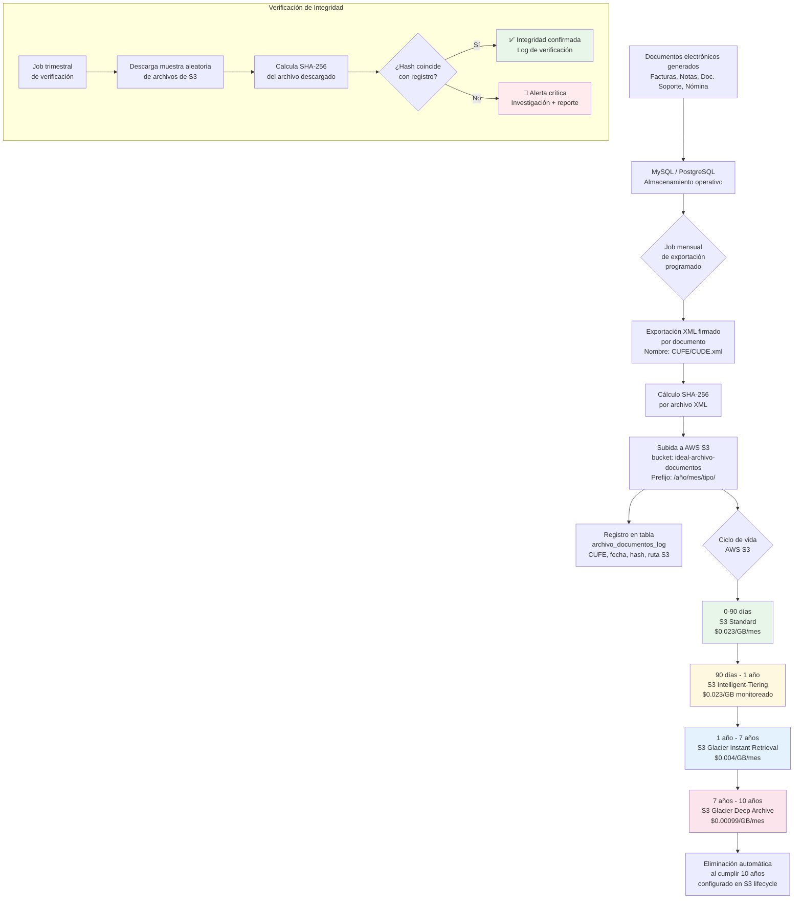

# Plan de Cumplimiento: Retención de Documentos Electrónicos a 10 Años

**Tipo de documento:** Plan de acción interno — confidencial  
**Empresa:** IDEAL SOFTWARE S.A.S  
**NIT:** 902.027.596-7  
**Elaborado por:** Ricardo Cermeño Bolaño — Director de Tecnología  
**Revisado por:** Felix Palacio Arguelle — Representante Legal  
**Fecha:** Mayo 2026  
**Versión:** 1.0  
**Documento relacionado:** `punto-8-infraestructura.md` (Numeral 8, Art. 55, Resolución 00165/2023)

---

## Tabla de Contenidos

1. [Resumen Ejecutivo](#1-resumen-ejecutivo)
2. [Marco Legal Aplicable](#2-marco-legal-aplicable)
3. [Estado Actual vs. Estado Requerido](#3-estado-actual-vs-estado-requerido)
4. [Arquitectura Propuesta de Archivado](#4-arquitectura-propuesta-de-archivado)
5. [Estrategia de Backup de Bases de Datos](#5-estrategia-de-backup-de-bases-de-datos)
6. [Lista de Verificación Pre-DIAN](#6-lista-de-verificación-pre-dian)
7. [Estimación de Costos](#7-estimación-de-costos)
8. [Texto a Insertar en punto-8-infraestructura.md](#8-texto-a-insertar-en-punto-8-infraestructuramd)
9. [Referencias Normativas](#9-referencias-normativas)

---

## 1. Resumen Ejecutivo

IDEAL SOFTWARE S.A.S opera actualmente con **backups automáticos de 7 días** en AWS Lightsail Managed Database. Este mecanismo es adecuado para la **recuperación operativa** (restaurar ante un fallo técnico), pero es completamente insuficiente para la **conservación legal** de documentos electrónicos tributarios, que exige retención de entre **5 y 10 años** según el Estatuto Tributario colombiano.

Esta distinción es fundamental: los **backups** son para recuperación ante desastres; el **archivado** es para cumplimiento legal. Son herramientas con propósitos diferentes que deben coexistir.

La brecha es significativa: 7 días (actual) vs. hasta 10 años (requerido). Esta brecha, si no se documenta y planifica ante la DIAN, puede ser un obstáculo para la habilitación como Proveedor Tecnológico de Facturación Electrónica, ya que el numeral 8 del artículo 55 de la Resolución 00165 de 2023 exige acreditar los mecanismos de **conservación** de documentos electrónicos.

**Buena noticia:** La solución técnica es sencilla y económica. AWS S3 con políticas de ciclo de vida puede manejar 10 años de archivado de XMLs firmados por un costo estimado de **menos de USD $2/mes** en su fase madura. La implementación puede completarse en 2-4 semanas de trabajo de ingeniería.

Este plan propone:
1. Un sistema de archivado en AWS S3 con transiciones automáticas por ciclo de vida
2. Una estrategia de snapshots mensuales de bases de datos para retención de 10 años
3. Un mecanismo de integridad mediante hashes SHA-256
4. El texto exacto a incluir en el documento de infraestructura para la DIAN

---

## 2. Marco Legal Aplicable

### 2.1 Artículo 632 del Estatuto Tributario — Obligación de Conservar Documentos

El **artículo 632 del Estatuto Tributario Nacional (E.T.)** establece la obligación de conservar documentos contables y tributarios. El texto del artículo (modificado por la Ley 2010 de 2019) establece:

> *"Para efectos del control de los impuestos administrados por la Unidad Administrativa Especial Dirección de Impuestos y Aduanas Nacionales (DIAN), las personas o entidades, contribuyentes o no contribuyentes de los mismos, deberán conservar por un período mínimo de **cinco (5) años** los documentos, informaciones y pruebas necesarios para establecer si son correctos los valores declarados y determinar los impuestos, anticipos, retenciones, ingresos, costos, deducciones, descuentos, exenciones y demás beneficios tributarios, con excepción de los documentos relativos a **activos fijos** para los cuales la obligación de conservación es de **diez (10) años**."*

**Plazos de conservación aplicables a IDEAL SOFTWARE:**

| Tipo de documento | Plazo mínimo | Artículo |
|-------------------|:---:|:---:|
| Factura electrónica de venta | 5 años | Art. 632 E.T. |
| Nota crédito y débito | 5 años | Art. 632 E.T. |
| Documento soporte en adquisiciones | 5 años | Art. 632 E.T. |
| Nómina electrónica | 5 años | Art. 632 E.T. |
| Libros de contabilidad (registros subyacentes) | 10 años | Art. 56, Código de Comercio |
| Documentos relativos a activos fijos | 10 años | Art. 632 E.T. párrafo 2 |

**Postura conservadora recomendada:** Dado que los documentos de facturación pueden ser requeridos en procesos de fiscalización que se extienden hasta 5 años después del año gravable (Art. 714 E.T.), y que el Código de Comercio establece 10 años para libros de contabilidad, se recomienda adoptar **10 años como horizonte de retención uniforme** para todos los documentos electrónicos generados por la plataforma. Esta es la postura más prudente y la que mejor resiste un proceso de fiscalización.

### 2.2 Resolución 000165 de 2023 — DIAN: Conservación de Documentos Electrónicos

La Resolución 000165 de 2023 (que regula a los Proveedores Tecnológicos de Facturación Electrónica) establece requisitos específicos de conservación:

**Artículo 55, numeral 8** — Entre los requisitos de infraestructura que debe acreditar el proveedor tecnológico, se incluye:
> *"Los mecanismos de conservación de los documentos electrónicos generados, garantizando la integridad, autenticidad y disponibilidad de los mismos durante el período establecido por la normativa tributaria vigente."*

**Artículo 16** — Sobre la conservación de la factura electrónica:
> *"El obligado a facturar y el adquirente deberán conservar el documento electrónico en el formato en que fue generado y transmitido, garantizando su integridad mediante el CUFE o CUDE y la firma digital del emisor."*

**Implicaciones para IDEAL SOFTWARE como proveedor tecnológico:**
- No basta con conservar datos en base de datos relacional; debe conservarse el **XML firmado** en el formato original
- La firma digital debe permanecer verificable durante todo el período de conservación
- La integridad del documento debe poder demostrarse (hash o firma)
- El documento debe estar **disponible** para consulta por parte del obligado tributario durante todo el período

### 2.3 Distinción Crítica: Backup vs. Archivado

Esta distinción es el concepto central de este plan y debe quedar explícita en la documentación para la DIAN:

| Dimensión | Backup (recuperación operativa) | Archivado (cumplimiento legal) |
|-----------|--------------------------------|-------------------------------|
| **Propósito** | Recuperar el sistema ante fallos técnicos | Conservar evidencia documental para efectos tributarios y legales |
| **Contenido** | Snapshot completo de la base de datos | Documentos individuales (XMLs firmados) con sus metadatos |
| **Retención** | Corta (días o semanas) | Larga (años o décadas) |
| **Formato** | Binario / propietario del motor de BD | Formato original del documento (XML UBL 2.1) |
| **Granularidad** | Base de datos completa | Documento por documento |
| **Verificabilidad** | No requiere verificación de integridad por documento | Requiere hash por documento para verificar integridad individual |
| **Acceso** | Restauración del sistema completo | Recuperación de documentos individuales |
| **Regulación** | Definido por RTO/RPO del negocio | Definido por norma tributaria |

**Analogía:** El backup es como tener una fotocopia de todos los documentos de la empresa en una caja fuerte para emergencias; el archivado es como mantener los documentos originales debidamente organizados y referenciados en un archivo notarial durante el tiempo que exige la ley. Son sistemas complementarios, no equivalentes.

### 2.4 Requisitos de Autenticidad e Integridad

La Resolución 000165 y el Decreto 2242 de 2015 (habilitación de la factura electrónica) establecen que los documentos conservados deben poder demostrar:

1. **Autenticidad del origen:** El documento fue efectivamente emitido por el obligado declarado (garantizado por la firma digital X.509)
2. **Integridad del contenido:** El documento no ha sido modificado desde su generación (garantizado por el CUFE/CUDE y la firma)
3. **Legibilidad:** El documento puede ser consultado y presentado en formato legible durante todo el período
4. **Disponibilidad:** El documento puede ser accedido cuando lo requiera la DIAN u otras autoridades competentes

El CUFE (Código Único de Factura Electrónica) calculado con SHA-384 y la firma digital del emisor son los mecanismos de integridad primarios. El archivado del XML original en AWS S3 preserva estos mecanismos nativos del documento.

---

## 3. Estado Actual vs. Estado Requerido

### 3.1 Estado Actual

| Componente | Configuración actual | ¿Cumple con 10 años? |
|-----------|---------------------|:---:|
| PostgreSQL (producción) | Backup automático Lightsail, retención 7 días | ❌ No |
| MySQL (producción) | Backup automático Lightsail, retención 7 días | ❌ No |
| XMLs de facturas | Almacenados en MySQL, sin archivado independiente | ❌ No |
| XMLs firmados DIAN | Almacenados en MySQL junto a datos operativos | ❌ No |
| Logs de transmisión | En base de datos operativa, sin retención extendida | ❌ No |
| Código fuente | Git (GitHub), retención indefinida | ✅ N/A |

**Diagnóstico:** La plataforma tiene **cero mecanismos de archivado legal a largo plazo**. Todo el almacenamiento actual es operativo, con una ventana de retención de 7 días para los datos más críticos (documentos electrónicos en base de datos) y sin ningún mecanismo de archivado independiente de las bases de datos.

### 3.2 Estado Requerido

| Componente | Estado requerido | Plazo |
|-----------|-----------------|:---:|
| XMLs firmados (facturas, notas, doc. soporte, nómina) | Archivado en S3 con ciclo de vida de 10 años, hash SHA-256 | Antes de DIAN |
| PostgreSQL snapshots | Snapshots mensuales retenidos 10 años en Lightsail | Antes de DIAN |
| MySQL snapshots | Snapshots mensuales retenidos 10 años en Lightsail | Antes de DIAN |
| Procedimiento de recuperación | Runbook documentado para recuperar documentos específicos | Antes de DIAN |
| Procedimiento de verificación de integridad | Script para verificar hashes de archivos archivados | Antes de DIAN |

### 3.3 Mapa de Brechas

```
ACTUAL:                              REQUERIDO:
┌────────────────────┐              ┌─────────────────────────────────┐
│  MySQL (producción)│              │  MySQL (producción)             │
│  Datos operativos  │              │  Datos operativos               │
│  Backup 7 días     │              │  Backup 7 días (sin cambios)    │
└────────────────────┘              │  + Snapshot mensual → 10 años  │
                                    └─────────────────────────────────┘
                                    
┌────────────────────┐              ┌─────────────────────────────────┐
│  PostgreSQL        │              │  PostgreSQL                     │
│  Datos operativos  │              │  Datos operativos               │
│  Backup 7 días     │              │  Backup 7 días (sin cambios)    │
└────────────────────┘              │  + Snapshot mensual → 10 años  │
                                    └─────────────────────────────────┘

                                    ┌─────────────────────────────────┐
            [VACÍO]                 │  AWS S3 — Archivo XML           │
         (no existe)                │  XMLs firmados exportados       │
                                    │  Hash SHA-256 por documento     │
                                    │  Ciclo de vida automático:      │
                                    │   0-90d  → S3 Standard          │
                                    │   90d-1y → S3 Int. Tiering      │
                                    │   1y-7y  → S3 Glacier Instant   │
                                    │   7y-10y → S3 Glacier Deep Arch.│
                                    └─────────────────────────────────┘
```

---

## 4. Arquitectura Propuesta de Archivado

### 4.1 Diagrama General



### 4.2 Estructura del Bucket S3

```
s3://ideal-archivo-documentos/
├── 2026/
│   ├── 01/
│   │   ├── factura/
│   │   │   ├── {CUFE-001}.xml
│   │   │   ├── {CUFE-001}.sha256
│   │   │   ├── {CUFE-002}.xml
│   │   │   └── {CUFE-002}.sha256
│   │   ├── nota-credito/
│   │   │   └── {CUDE-001}.xml
│   │   ├── nota-debito/
│   │   ├── documento-soporte/
│   │   └── nomina/
│   └── 02/
│       └── ...
├── 2027/
│   └── ...
└── manifiestos/
    ├── 2026-01-manifiesto.json    ← Índice del mes
    ├── 2026-02-manifiesto.json
    └── ...
```

**Archivo de manifiesto mensual (JSON):**
```json
{
  "periodo": "2026-01",
  "empresa_nit": "902.027.596-7",
  "fecha_creacion": "2026-02-01T04:00:00Z",
  "total_documentos": 1247,
  "documentos": [
    {
      "cufe": "abc123...def456",
      "tipo": "factura",
      "numero": "FV-001234",
      "fecha_emision": "2026-01-15",
      "nit_emisor": "900123456-1",
      "ruta_s3": "2026/01/factura/abc123...def456.xml",
      "sha256": "e3b0c44298fc1c149afb...",
      "tamanio_bytes": 8432
    }
  ],
  "hash_manifiesto": "sha256:ab12cd34..."
}
```

### 4.3 Configuración de Ciclo de Vida S3 (Lifecycle Policy)

La política de ciclo de vida se configura en AWS S3 para el bucket `ideal-archivo-documentos`:

```json
{
  "Rules": [
    {
      "ID": "ArchivadoDocumentosElectronicos10Anios",
      "Status": "Enabled",
      "Filter": { "Prefix": "" },
      "Transitions": [
        {
          "Days": 90,
          "StorageClass": "INTELLIGENT_TIERING"
        },
        {
          "Days": 365,
          "StorageClass": "GLACIER_IR"
        },
        {
          "Days": 2555,
          "StorageClass": "DEEP_ARCHIVE"
        }
      ],
      "Expiration": {
        "Days": 3650
      }
    }
  ]
}
```

**Nota:** 3650 días = 10 años. 2555 días ≈ 7 años. Revisar el cómputo del plazo tributario:
el plazo de 5 años del Art. 632 E.T. se cuenta a partir de la fecha de vencimiento de la declaración del año gravable (no desde la fecha del documento), por lo que documentos de 2026 deben conservarse hasta aproximadamente 2032. Con el horizonte de 10 años configurado, todos los plazos quedan sobradamente cubiertos.

### 4.4 Mecanismo de Exportación Mensual

**Trigger:** Job programado, primer día de cada mes a las 02:00 UTC (fuera de horario pico)

**Pseudocódigo del proceso de exportación:**

```typescript
// Job mensual de archivado - ejecuta el 1ro de cada mes
async function archivarDocumentosDelMesPasado() {
  const periodo = getMesPasado(); // ej: "2026-01"
  
  // 1. Obtener todos los XMLs firmados del mes anterior desde MySQL
  const documentos = await mysql.query(`
    SELECT 
      cufe_cude,
      tipo_documento,
      numero_documento,
      fecha_emision,
      nit_emisor,
      xml_firmado,  -- El XML UBL 2.1 completo con firma
      xml_respuesta_dian  -- La respuesta de validación de la DIAN
    FROM documentos_electronicos
    WHERE DATE_FORMAT(fecha_emision, '%Y-%m') = ?
    AND estado_dian = 'APROBADO'
  `, [periodo]);
  
  const manifiesto = { periodo, documentos: [] };
  
  for (const doc of documentos) {
    // 2. Calcular hash SHA-256 del XML
    const hash = crypto.createHash('sha256')
                       .update(doc.xml_firmado)
                       .digest('hex');
    
    // 3. Construir ruta S3
    const rutaXml = `${periodo.slice(0,4)}/${periodo.slice(5,7)}/${doc.tipo}/${doc.cufe_cude}.xml`;
    const rutaHash = rutaXml.replace('.xml', '.sha256');
    
    // 4. Subir XML a S3
    await s3.putObject({
      Bucket: 'ideal-archivo-documentos',
      Key: rutaXml,
      Body: doc.xml_firmado,
      ContentType: 'application/xml',
      Metadata: {
        'cufe-cude': doc.cufe_cude,
        'tipo-documento': doc.tipo_documento,
        'numero': doc.numero_documento,
        'fecha-emision': doc.fecha_emision,
        'sha256': hash
      }
    });
    
    // 5. Subir archivo de hash
    await s3.putObject({
      Bucket: 'ideal-archivo-documentos',
      Key: rutaHash,
      Body: hash,
      ContentType: 'text/plain'
    });
    
    // 6. Registrar en tabla de log
    await postgres.query(`
      INSERT INTO archivo_documentos_log 
        (cufe_cude, periodo, ruta_s3, sha256, fecha_archivado, tamanio_bytes)
      VALUES (?, ?, ?, ?, NOW(), ?)
    `, [doc.cufe_cude, periodo, rutaXml, hash, doc.xml_firmado.length]);
    
    manifiesto.documentos.push({ cufe: doc.cufe_cude, sha256: hash, ruta: rutaXml });
  }
  
  // 7. Subir manifiesto del mes
  await s3.putObject({
    Bucket: 'ideal-archivo-documentos',
    Key: `manifiestos/${periodo}-manifiesto.json`,
    Body: JSON.stringify(manifiesto, null, 2)
  });
}
```

### 4.5 Procedimiento de Recuperación de Documentos Archivados

Cuando la DIAN, un cliente, o un proceso de auditoría requiera un documento específico:

**Caso 1 — Documento reciente (menos de 1 año): recuperación inmediata**
```bash
aws s3 cp s3://ideal-archivo-documentos/2026/01/factura/{CUFE}.xml ./recuperado/
# Tiempo: segundos
# Costo: $0.0004 por GB descargado
```

**Caso 2 — Documento en Glacier Instant Retrieval (1-7 años): recuperación en milisegundos**
```bash
aws s3 cp s3://ideal-archivo-documentos/2024/01/factura/{CUFE}.xml ./recuperado/
# Tiempo: milisegundos (Instant Retrieval)
# Costo: $0.03 por GB restaurado + $0.0004 por GB descargado
```

**Caso 3 — Documento en Glacier Deep Archive (7-10 años): recuperación en 12-48 horas**
```bash
# Paso 1: Iniciar restauración (tarda 12-48 horas)
aws s3api restore-object \
  --bucket ideal-archivo-documentos \
  --key "2016/01/factura/{CUFE}.xml" \
  --restore-request '{"Days":7,"GlacierJobParameters":{"Tier":"Standard"}}'

# Paso 2: Verificar que la restauración esté disponible
aws s3api head-object \
  --bucket ideal-archivo-documentos \
  --key "2016/01/factura/{CUFE}.xml"

# Paso 3: Descargar cuando esté disponible
aws s3 cp s3://ideal-archivo-documentos/2016/01/factura/{CUFE}.xml ./recuperado/
# Costo: $0.02 por GB restaurado + $0.0004 por GB descargado
```

**Verificación de integridad al recuperar:**
```bash
# Descargar el archivo de hash
aws s3 cp s3://ideal-archivo-documentos/2026/01/factura/{CUFE}.sha256 ./recuperado/

# Calcular hash del archivo recuperado
sha256sum ./recuperado/{CUFE}.xml

# Comparar con hash archivado
cat ./recuperado/{CUFE}.sha256

# Si los valores coinciden: el documento es íntegro y auténtico
```

---

## 5. Estrategia de Backup de Bases de Datos

### 5.1 Configuración Actual (sin cambios)

Los backups automáticos de 7 días de Lightsail Managed Database se mantienen como están. Su propósito es la recuperación operativa (RPO ≤ 24 horas, RTO ≤ 2 horas). No se modifican.

### 5.2 Snapshots Manuales Mensuales para Retención a Largo Plazo

Adicionalmente a los backups automáticos, se crean **snapshots manuales mensuales** que se retienen hasta 10 años:

| Parámetro | Configuración |
|-----------|--------------|
| **Frecuencia** | Mensual — primer día del mes, 03:00 UTC |
| **Retención** | Los snapshots manuales en Lightsail no tienen expiración automática — deben eliminarse manualmente al cumplir 10 años |
| **Bases de datos** | ideal-production-postgres + ideal-production-mysql |
| **Nombrado** | `snap-postgres-AAAA-MM` / `snap-mysql-AAAA-MM` |
| **Costo** | Ver sección 7 (estimación de costos) |

**Procedimiento mensual (ejecutar el 1ro de cada mes):**

```bash
#!/bin/bash
# Script: snapshot-mensual.sh
# Ejecutar como cron job: 0 3 1 * * /home/ubuntu/scripts/snapshot-mensual.sh

PERIODO=$(date +%Y-%m)
LOG="/var/log/snapshots-idealsoftware.log"

echo "[$PERIODO] Iniciando snapshot mensual..." >> $LOG

# PostgreSQL snapshot
aws lightsail create-relational-database-snapshot \
  --relational-database-name ideal-production-postgres \
  --relational-database-snapshot-name "snap-postgres-${PERIODO}" \
  --region us-east-1

# MySQL snapshot  
aws lightsail create-relational-database-snapshot \
  --relational-database-name ideal-production-mysql \
  --relational-database-snapshot-name "snap-mysql-${PERIODO}" \
  --region us-east-1

echo "[$PERIODO] Snapshots creados exitosamente." >> $LOG

# Verificar que existen los snapshots
aws lightsail get-relational-database-snapshot \
  --relational-database-snapshot-name "snap-postgres-${PERIODO}" \
  --query 'relationalDatabaseSnapshot.state' --output text >> $LOG
```

**Nota importante:** Los snapshots de Lightsail Managed Database no tienen una API de expiración automática equivalente a S3 Lifecycle. Se debe implementar un proceso de gobierno para:
1. Registrar cada snapshot creado con su fecha en una hoja de control
2. Programar la eliminación manual (o vía script) al cumplir 10 años + 6 meses de margen

### 5.3 Registro de Control de Snapshots

Mantener una hoja de control (Google Sheets o similar) con el inventario de snapshots:

| Snapshot | Base de datos | Fecha creación | Fecha eliminación programada | Estado |
|---------|:---:|:---:|:---:|:---:|
| snap-postgres-2026-05 | PostgreSQL | 2026-06-01 | 2036-12-31 | Activo |
| snap-mysql-2026-05 | MySQL | 2026-06-01 | 2036-12-31 | Activo |
| snap-postgres-2026-06 | PostgreSQL | 2026-07-01 | 2037-01-31 | Activo |
| ... | ... | ... | ... | ... |

---

## 6. Lista de Verificación Pre-DIAN

### 6.1 Infraestructura S3

- [ ] **S3-1** Bucket `ideal-archivo-documentos` creado en AWS us-east-1
- [ ] **S3-2** Bucket con acceso público bloqueado (Block Public Access: ON)
- [ ] **S3-3** Versionado del bucket habilitado (S3 Versioning)
- [ ] **S3-4** Política de ciclo de vida configurada (90d → Intelligent-Tiering → 1y → Glacier IR → 7y → Glacier Deep Archive → 10y → Delete)
- [ ] **S3-5** Cifrado del bucket configurado (SSE-S3 o SSE-KMS)
- [ ] **S3-6** Logs de acceso al bucket habilitados
- [ ] **S3-7** Política de retención de objetos (Object Lock) configurada para prevenir eliminación accidental
- [ ] **S3-8** Credenciales IAM con mínimo privilegio creadas para el job de exportación

### 6.2 Proceso de Exportación

- [ ] **EXP-1** Tabla `archivo_documentos_log` creada en PostgreSQL con esquema documentado
- [ ] **EXP-2** Job de exportación mensual desarrollado y probado en ambiente QA
- [ ] **EXP-3** Job de exportación probado con datos reales de un mes (exportación de prueba)
- [ ] **EXP-4** Verificación que los XMLs exportados son idénticos a los transmitidos a la DIAN (comparación de CUFE)
- [ ] **EXP-5** Job configurado en cron/scheduler del servidor de producción
- [ ] **EXP-6** Alertas configuradas si el job falla (email/Grafana)
- [ ] **EXP-7** Job de verificación trimestral de integridad (hash) desarrollado y configurado

### 6.3 Snapshots de Base de Datos

- [ ] **SNAP-1** Script `snapshot-mensual.sh` creado y probado
- [ ] **SNAP-2** Permisos IAM para ejecutar snapshots de Lightsail configurados
- [ ] **SNAP-3** Primer snapshot manual creado y verificado (PostgreSQL + MySQL)
- [ ] **SNAP-4** Script configurado en cron del servidor de producción
- [ ] **SNAP-5** Hoja de control de snapshots creada con proyección a 10 años

### 6.4 Documentación

- [ ] **DOC-1** Runbook de recuperación de documentos archivados documentado
- [ ] **DOC-2** Procedimiento de restauración desde Glacier Deep Archive documentado
- [ ] **DOC-3** Sección 7.2 incluida en `punto-8-infraestructura.md`
- [ ] **DOC-4** Evidencia del bucket S3 y lifecycle policy (capturas de pantalla para expediente DIAN)
- [ ] **DOC-5** Evidencia del primer snapshot mensual creado (captura consola Lightsail)

---

## 7. Estimación de Costos

### 7.1 Costo de Archivado en AWS S3

**Supuestos de cálculo:**

| Parámetro | Valor | Justificación |
|-----------|:---:|:---:|
| Promedio de documentos por mes | 10,000 | Estimación conservadora para crecimiento de la plataforma |
| Tamaño promedio por XML firmado (UBL 2.1) | ~10 KB | XML de factura + firma digital + namespace UBL |
| Total por mes | ~100 MB | 10,000 × 10 KB |
| Total por año | ~1.2 GB | 100 MB × 12 meses |
| Total acumulado a 10 años | ~12 GB | Suma lineal (sin crecimiento) |
| Total acumulado a 10 años (con crecimiento 20%/año) | ~30 GB | Proyección realista |

**Costo mensual por clase de almacenamiento (precios AWS us-east-1, mayo 2026):**

| Clase | Precio por GB/mes | GB almacenados (año 5) | Costo mensual |
|-------|:---:|:---:|:---:|
| S3 Standard (0-90 días) | $0.023/GB | 0.1 GB (solo el mes actual) | ~$0.002 |
| S3 Intelligent-Tiering | $0.023/GB | ~0.3 GB (meses 3-12) | ~$0.007 |
| S3 Glacier Instant Retrieval | $0.004/GB | ~5 GB (años 1-7) | ~$0.020 |
| S3 Glacier Deep Archive | $0.00099/GB | ~7 GB (años 7-10) | ~$0.007 |
| **Total estimado mes (año 5)** | | | **~$0.04/mes** |
| **Total estimado mes (año 10)** | | | **~$0.12/mes** |

**Costos adicionales menores:**
- Solicitudes PUT por subida de archivos: ~$0.005/mes (10,000 objetos × $0.0000005)
- Costos de restauración desde Glacier Deep Archive: $0.02/GB (infrecuente, solo en auditorías)
- Transferencia de datos salientes: $0.09/GB (solo cuando se descarga — mínimo)

**Costo total estimado del sistema de archivado a 10 años: < USD $20 en total (aproximadamente USD $0.05/mes promedio a lo largo de la vida del sistema).**

Esta cifra es prácticamente despreciable frente al costo de una sanción tributaria o la pérdida de la habilitación DIAN.

### 7.2 Costo de Snapshots Mensuales de Base de Datos

Los snapshots manuales de Lightsail Managed Database tienen un costo de almacenamiento:

| Parámetro | Valor |
|-----------|:---:|
| Precio del almacenamiento de snapshot Lightsail | $0.05/GB/mes |
| Tamaño estimado del snapshot PostgreSQL | ~5 GB (creciendo) |
| Tamaño estimado del snapshot MySQL | ~3 GB (creciendo) |
| Número de snapshots mensuales acumulados a 10 años | 120 snapshots por BD |
| Costo aproximado mes 60 (año 5) | ~$40/mes |
| Costo aproximado mes 120 (año 10) | ~$80/mes |

**Alternativa de menor costo:** En lugar de conservar todos los snapshots mensuales durante 10 años, se puede adoptar una política de snapshots **trimestrales** para años anteriores al quinto año, reduciendo el costo a ~$30/mes en el año 10.

**Recomendación:** Dado que los XMLs firmados se archivan independientemente en S3 (que es lo que exige la Resolución 00165), los snapshots mensuales de BD son un mecanismo complementario de seguridad. Para la certificación DIAN, el argumento principal es el archivado de XMLs en S3. Los snapshots de BD se documentan como medida adicional.

### 7.3 Resumen de Costos

| Componente | Costo mensual (año 1) | Costo mensual (año 5) | Costo mensual (año 10) |
|-----------|:---:|:---:|:---:|
| Archivado XML en S3 | ~$0.01 | ~$0.04 | ~$0.12 |
| Snapshots BD mensuales | ~$4 | ~$40 | ~$80 |
| **Total** | **~$4/mes** | **~$40/mes** | **~$80/mes** |

**Nota:** El costo de snapshots de BD puede optimizarse adoptando una política de retención trimestral después del primer año, sin afectar el cumplimiento legal (los XMLs firmados en S3 son el mecanismo principal).

---

## 8. Texto a Insertar en punto-8-infraestructura.md

El siguiente texto debe insertarse como nueva **sección 7.2** en el documento `punto-8-infraestructura.md`, inmediatamente después de la sección 7.1 ("Backups y Recuperación de Datos") y antes de la sección 7.2 actual ("Alta Disponibilidad", que pasaría a ser 7.3).

---

### INICIO DEL TEXTO A INSERTAR

```markdown
### 7.2 Conservación a Largo Plazo de Documentos Electrónicos

#### 7.2.1 Distinción entre Backup y Archivado Legal

IDEAL SOFTWARE S.A.S implementa dos sistemas de retención de datos con propósitos distintos y complementarios:

| Dimensión | Backup (Sección 7.1) | Archivado Legal (esta sección) |
|-----------|---------------------|-------------------------------|
| **Propósito** | Recuperación operativa ante fallos | Conservación de documentos tributarios |
| **Retención** | 7 días | 10 años |
| **Formato** | Snapshot binario de base de datos | XML UBL 2.1 original firmado |
| **Granularidad** | Base de datos completa | Documento por documento |
| **Obligación** | Definida por RPO/RTO del negocio | Definida por Art. 632 E.T. + Res. 000165/2023 |

#### 7.2.2 Obligación Legal de Conservación

Conforme al **artículo 632 del Estatuto Tributario** (modificado por Ley 2010 de 2019) y al artículo 55 numeral 8 de la **Resolución 000165 de 2023**, IDEAL SOFTWARE S.A.S está obligada a conservar los documentos electrónicos generados en su plataforma por un período de **10 años**, garantizando su integridad, autenticidad y disponibilidad.

#### 7.2.3 Arquitectura de Archivado en AWS S3

Los documentos electrónicos (XMLs UBL 2.1 firmados) se exportan mensualmente a **AWS S3** con el siguiente ciclo de vida automático:

| Período | Clase de almacenamiento | Costo | Tiempo de recuperación |
|---------|------------------------|:---:|:---:|
| 0 — 90 días | S3 Standard | $0.023/GB/mes | Inmediato |
| 90 días — 1 año | S3 Intelligent-Tiering | $0.023/GB/mes | Inmediato |
| 1 año — 7 años | S3 Glacier Instant Retrieval | $0.004/GB/mes | Milisegundos |
| 7 años — 10 años | S3 Glacier Deep Archive | $0.00099/GB/mes | 12-48 horas |
| Al cumplir 10 años | Eliminación automática | — | — |

**Bucket:** `ideal-archivo-documentos` (AWS us-east-1)  
**Acceso:** Privado — bloqueado el acceso público  
**Cifrado:** AES-256 (SSE-S3)  
**Versionado:** Habilitado

#### 7.2.4 Integridad de Documentos Archivados

Cada documento archivado cuenta con los siguientes mecanismos de verificación de integridad:

1. **CUFE/CUDE** (SHA-384): Código único calculado al momento de la generación, garantizado por la DIAN en la respuesta de validación
2. **Firma digital X.509**: Firma del emisor embebida en el XML UBL 2.1, verificable con el certificado del emisor
3. **Hash SHA-256 propio**: Calculado en el momento del archivado y almacenado junto al XML en S3

Un **job trimestral de verificación** descarga una muestra aleatoria de los archivos y verifica que los hashes SHA-256 coincidan con los registros originales. Las alertas se envían al equipo de tecnología en caso de discrepancia.

#### 7.2.5 Proceso de Exportación Mensual

El primer día de cada mes, a las 02:00 UTC, se ejecuta automáticamente un job que:

1. Extrae del motor de base de datos todos los XMLs firmados del mes anterior con estado `APROBADO` por la DIAN
2. Calcula el hash SHA-256 de cada documento
3. Sube los XMLs a S3 bajo la estructura `/año/mes/tipo_documento/CUFE.xml`
4. Registra en tabla de log: CUFE, ruta S3, hash, fecha de archivado, tamaño
5. Genera un manifiesto mensual JSON con el inventario completo del período
6. Envía notificación de éxito/falla al equipo de tecnología

#### 7.2.6 Documentos Conservados

| Tipo de documento | Artículo habilitante | Identificador | Plazo de conservación |
|-------------------|---------------------|:---:|:---:|
| Factura electrónica de venta | Art. 617 E.T. | CUFE | 10 años |
| Nota crédito | Art. 511 E.T. | CUDE | 10 años |
| Nota débito | Art. 511 E.T. | CUDE | 10 años |
| Documento soporte en adquisiciones | Art. 55, Res. 000165/2023 | CUDE | 10 años |
| Nómina electrónica | Art. 55, Res. 000165/2023 | CUNE | 10 años |

#### 7.2.7 Snapshots Mensuales de Base de Datos

Adicionalmente al archivado de XMLs en S3, se realizan **snapshots manuales mensuales** de las bases de datos gestionadas Lightsail, que se conservan durante 10 años como respaldo complementario:

| Snapshot | Base de datos | Frecuencia | Retención |
|---------|:---:|:---:|:---:|
| snap-postgres-AAAA-MM | PostgreSQL (producción) | Mensual | 10 años |
| snap-mysql-AAAA-MM | MySQL (producción) | Mensual | 10 años |

#### 7.2.8 Costo Estimado del Sistema de Archivado

El costo total del sistema de archivado es marginalmente bajo:

| Componente | Costo estimado (año 10) |
|-----------|:---:|
| Archivado XML en AWS S3 | ~USD $0.12/mes |
| Snapshots mensuales de BD | ~USD $80/mes |
| **Total** | **~USD $80/mes en año 10** |

#### 7.2.9 Procedimiento de Recuperación de Documentos

Para recuperar un documento archivado ante requerimiento de la DIAN o auditoría:

1. Identificar el CUFE/CUDE del documento requerido
2. Consultar la tabla `archivo_documentos_log` para obtener la ruta S3 y el hash esperado
3. Para documentos en S3 Standard/Intelligent-Tiering/Glacier IR: descarga inmediata vía AWS CLI
4. Para documentos en Glacier Deep Archive: iniciar restauración (12-48 horas de espera)
5. Verificar integridad del documento recuperado comparando el hash SHA-256 con el registro
6. Entregar el XML original a la autoridad competente

El tiempo máximo de recuperación para documentos en Glacier Deep Archive es de **48 horas**, dentro del plazo razonable para atender requerimientos tributarios.
```

### FIN DEL TEXTO A INSERTAR

---

## 9. Referencias Normativas

| Norma / Documento | Descripción | Vigencia |
|-------------------|-------------|:---:|
| Artículo 632, Estatuto Tributario | Obligación de conservar documentos tributarios | Vigente (mod. Ley 2010/2019) |
| Artículo 714, Estatuto Tributario | Término de firmeza de las declaraciones tributarias | Vigente |
| Artículo 56, Código de Comercio | Conservación de libros de contabilidad por 10 años | Vigente |
| Resolución 000165 de 2023, DIAN | Art. 55 Num. 8 — Conservación de documentos electrónicos | Vigente |
| Decreto 2242 de 2015 | Habilitación de la factura electrónica, integridad y autenticidad | Vigente |
| Ley 527 de 1999 | Valor probatorio de mensajes de datos y documentos electrónicos | Vigente |
| Ley 2010 de 2019 | Modifica el Estatuto Tributario (incluye Art. 632) | Vigente |
| AWS S3 Pricing | Precios de almacenamiento por clase — us-east-1 | aws.amazon.com/s3/pricing |
| AWS Lightsail Snapshot Pricing | Precios de snapshots de bases de datos gestionadas | aws.amazon.com/lightsail/pricing |
| ISO/IEC 27037:2012 | Identificación, recolección, adquisición y preservación de evidencia digital | Referencia |

---

*Documento preparado por el área de tecnología de IDEAL SOFTWARE S.A.S para uso interno y presentación ante la DIAN. No debe distribuirse sin autorización del representante legal.*

*Próxima revisión: antes de la presentación del expediente de habilitación ante la DIAN o cuando se produzcan cambios en la normativa tributaria.*
