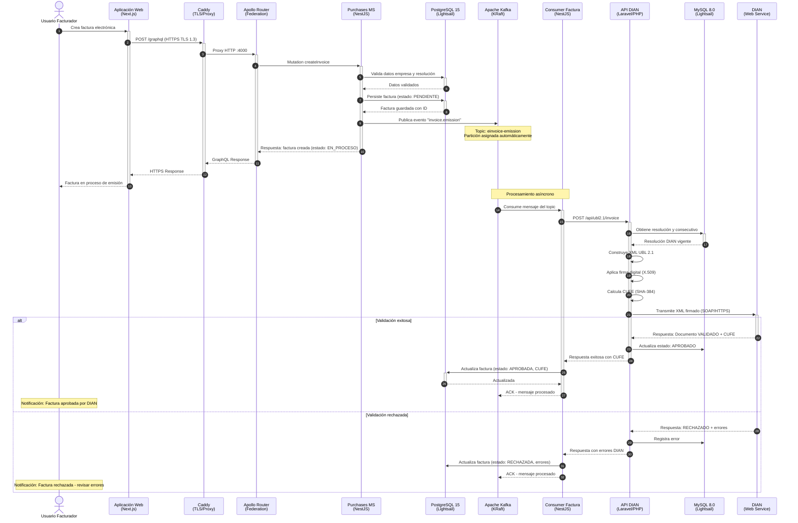
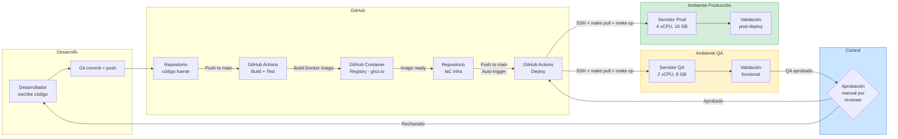
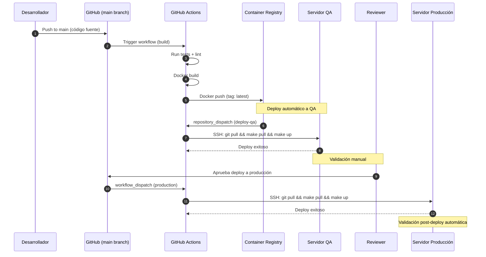

# Anexo A - Diagramas de Arquitectura

**Referencia:** Punto 8, Numeral 8, Artículo 55, Resolución 00165 de 2023
**Empresa:** IDEAL SOFTWARE S.A.S | NIT: 902.027.596-7
**Fecha:** Mayo 2026 | **Versión:** 1.0

---

## Diagrama 1: Arquitectura General del Servicio

Visión de alto nivel del sistema de facturación electrónica, mostrando la relación entre usuarios, componentes internos y sistemas externos.

```mermaid
C4Container
    title Arquitectura General - Plataforma de Facturación Electrónica

    Person(usuario, "Usuario Facturador", "Empresa colombiana que emite facturas electrónicas")
    Person(admin, "Administrador", "Equipo técnico de Ideal Software")

    System_Ext(dian, "DIAN", "Web Services de validación previa de factura electrónica")
    System_Ext(firebase, "Firebase Auth", "Autenticación de usuarios")
    System_Ext(letsencrypt, "Let's Encrypt", "Emisión automática de certificados TLS")
    System_Ext(grafana_cloud, "Grafana Cloud", "Monitoreo, métricas y logs")
    System_Ext(aws_s3, "AWS S3", "Almacenamiento de archivos y documentos")

    Container_Boundary(infra, "AWS Lightsail - Producción (us-east-1)") {

        Container_Boundary(proxy_layer, "Capa de Proxy y TLS") {
            Container(caddy, "Caddy 2.8.4", "Alpine Linux", "Reverse proxy, TLS automático, HTTP/3, compresión GZIP")
        }

        Container_Boundary(api_layer, "Capa de API - GraphQL Federation v2") {
            Container(router, "Apollo Router", "Rust", "Gateway GraphQL Federation, enrutamiento de queries a subgraphs")
            Container(core, "Core MS", "NestJS/Node.js", "Empresas, usuarios, autenticación, configuración general")
            Container(inventory, "Inventory MS", "NestJS/Node.js", "Gestión de inventario y productos")
            Container(purchases, "Purchases MS", "NestJS/Node.js", "Compras, facturación de venta, notas crédito/débito")
            Container(accounting, "Accounting MS", "NestJS/Node.js", "Plan de cuentas, asientos contables, estados financieros")
            Container(report, "Report MS", "NestJS/Node.js", "Generación de reportes contables y tributarios")
            Container(payroll, "Payroll MS", "NestJS/Node.js", "Nómina electrónica, liquidaciones, ajustes")
            Container(treasury, "Treasury MS", "NestJS/Node.js", "Tesorería, flujo de caja, conciliaciones")
            Container(fileuploader, "File Uploader MS", "NestJS/Node.js", "Carga y gestión de archivos adjuntos")
        }

        Container_Boundary(event_layer, "Capa de Event Streaming") {
            ContainerQueue(kafka, "Apache Kafka 3.9", "KRaft Mode", "Broker de mensajes para procesamiento asíncrono de documentos electrónicos")
            Container(consumer_einvoice, "Consumer Factura", "NestJS/Node.js", "Emisión de factura electrónica")
            Container(consumer_credit, "Consumer Nota Crédito", "NestJS/Node.js", "Emisión de notas crédito")
            Container(consumer_debit, "Consumer Nota Débito", "NestJS/Node.js", "Emisión de notas débito")
            Container(consumer_docsupport, "Consumer Doc. Soporte", "NestJS/Node.js", "Emisión documento soporte")
            Container(consumer_payroll, "Consumer Nómina", "NestJS/Node.js", "Emisión nómina electrónica")
            Container(consumer_payroll_adj, "Consumer Ajuste Nómina", "NestJS/Node.js", "Emisión ajuste de nómina")
        }

        Container_Boundary(dian_layer, "Capa de Integración DIAN") {
            Container(api_dian, "API DIAN", "Laravel/PHP", "Firma digital, construcción UBL 2.1 XML, transmisión a DIAN")
        }

        Container_Boundary(frontend_layer, "Capa de Presentación") {
            Container(webapp, "Aplicación Web", "Next.js/React", "Interfaz de usuario para facturación y contabilidad")
        }

        Container_Boundary(data_layer, "Capa de Datos - Lightsail Managed DB") {
            ContainerDb(postgres, "PostgreSQL 15", "Lightsail Managed DB", "Datos de microservicios NestJS: empresas, facturas, contabilidad, nómina")
            ContainerDb(mysql, "MySQL 8.0", "Lightsail Managed DB", "Datos de API DIAN: resoluciones, consecutivos, XMLs")
        }

        Container_Boundary(monitoring_layer, "Capa de Monitoreo") {
            Container(alloy, "Grafana Alloy", "Go", "Recolección de métricas y logs, envío a Grafana Cloud")
            Container(cadvisor, "cAdvisor", "Go", "Métricas de containers: CPU, memoria, red, disco")
        }
    }

    Rel(usuario, caddy, "Accede via HTTPS", "TLS 1.3")
    Rel(admin, caddy, "Administra via SSH", "ed25519")
    Rel(caddy, router, "Proxy GraphQL", "HTTP :4000")
    Rel(caddy, fileuploader, "Proxy uploads", "HTTP :3003")
    Rel(caddy, webapp, "Proxy frontend", "HTTP :3100")

    Rel(router, core, "Subgraph", "HTTP :3000/graphql")
    Rel(router, inventory, "Subgraph", "HTTP :3001/graphql")
    Rel(router, purchases, "Subgraph", "HTTP :3002/graphql")
    Rel(router, accounting, "Subgraph", "HTTP :3004/graphql")
    Rel(router, report, "Subgraph", "HTTP :3005/graphql")
    Rel(router, payroll, "Subgraph", "HTTP :3006/graphql")
    Rel(router, treasury, "Subgraph", "HTTP :3007/graphql")

    Rel(purchases, kafka, "Publica eventos de facturación", "TCP :9093")
    Rel(payroll, kafka, "Publica eventos de nómina", "TCP :9093")

    Rel(kafka, consumer_einvoice, "Consume topic factura", "TCP :9093")
    Rel(kafka, consumer_credit, "Consume topic nota crédito", "TCP :9093")
    Rel(kafka, consumer_debit, "Consume topic nota débito", "TCP :9093")
    Rel(kafka, consumer_docsupport, "Consume topic doc. soporte", "TCP :9093")
    Rel(kafka, consumer_payroll, "Consume topic nómina", "TCP :9093")
    Rel(kafka, consumer_payroll_adj, "Consume topic ajuste nómina", "TCP :9093")

    Rel(consumer_einvoice, api_dian, "Envía documento", "HTTP :80/api/ubl2.1")
    Rel(consumer_credit, api_dian, "Envía documento", "HTTP :80/api/ubl2.1")
    Rel(consumer_debit, api_dian, "Envía documento", "HTTP :80/api/ubl2.1")
    Rel(consumer_docsupport, api_dian, "Envía documento", "HTTP :80/api/ubl2.1")
    Rel(consumer_payroll, api_dian, "Envía documento", "HTTP :80/api/ubl2.1")
    Rel(consumer_payroll_adj, api_dian, "Envía documento", "HTTP :80/api/ubl2.1")

    Rel(api_dian, dian, "Transmite XML firmado", "HTTPS/SOAP")

    Rel(core, postgres, "Lee/escribe", "TCP :5432")
    Rel(purchases, postgres, "Lee/escribe", "TCP :5432")
    Rel(payroll, postgres, "Lee/escribe", "TCP :5432")
    Rel(accounting, postgres, "Lee/escribe", "TCP :5432")
    Rel(api_dian, mysql, "Lee/escribe", "TCP :3306")

    Rel(core, firebase, "Valida tokens", "HTTPS")
    Rel(caddy, letsencrypt, "Obtiene certificados", "ACME HTTP-01")
    Rel(alloy, grafana_cloud, "Envía telemetría", "HTTPS")
    Rel(fileuploader, aws_s3, "Almacena archivos", "HTTPS/S3 API")
```

---

## Diagrama 2: Flujo de Emisión de Factura Electrónica

Proceso completo desde que el usuario genera una factura hasta la validación por parte de la DIAN y la obtención del CUFE.

---

## Diagrama 3: Topología de Redes Docker

Muestra el aislamiento de servicios mediante redes Docker y la comunicación controlada entre componentes.

```mermaid
flowchart TB
    subgraph internet["Internet (Público)"]
        user([Usuarios])
        dian_ext([DIAN Web Services])
    end

    subgraph firewall["Firewall AWS Lightsail"]
        direction TB
        port80[Puerto 80 - HTTP]
        port443[Puerto 443 - HTTPS/QUIC]
        port22[Puerto 22 - SSH<br/>Restringido a CIDRs]
    end

    subgraph server["Servidor Producción - AWS Lightsail (4 vCPU, 16 GB RAM)"]

        subgraph net_accounting["accounting-iac_accounting-net"]
            caddy_a[Caddy]
            router_a[Apollo Router :4000]
            core_a[Core MS :3000]
            inventory_a[Inventory MS :3001]
            purchases_a[Purchases MS :3002]
            fileuploader_a[File Uploader MS :3003]
            accounting_a[Accounting MS :3004]
            report_a[Report MS :3005]
            payroll_a[Payroll MS :3006]
            treasury_a[Treasury MS :3007]
        end

        subgraph net_dian["dian-api-iac_api-dian-net"]
            api_dian_d[API DIAN :80]
            core_d[Core MS]
            purchases_d[Purchases MS]
            payroll_d[Payroll MS]
            consumers_d[6 Consumers]
        end

        subgraph net_kafka["kafka-iac_kafka-net"]
            kafka_k[Kafka :9093]
            purchases_k[Purchases MS]
            payroll_k[Payroll MS]
            consumers_k[6 Consumers]
        end

        subgraph net_kafkaui["kafka-iac_kafkaui-net"]
            kafka_ui[Kafka UI :8080]
            kafka_kui[Kafka]
            caddy_kui[Caddy]
        end

        subgraph net_app["ideal-app-iac_ideal-app-net"]
            webapp_app[Ideal App :3100]
            caddy_app[Caddy]
        end

        subgraph net_monitoring["monitoring-iac_monitoring-net"]
            alloy_m[Grafana Alloy]
            cadvisor_m[cAdvisor :8080]
        end

        subgraph databases["Lightsail Managed Database (Externo a containers)"]
            postgres_db[(PostgreSQL 15<br/>NO público)]
            mysql_db[(MySQL 8.0<br/>NO público)]
        end
    end

    user --> port80 & port443
    port80 & port443 --> caddy_a
    port22 -.->|Solo CIDRs autorizados| server

    caddy_a --> router_a
    caddy_a --> fileuploader_a
    caddy_app --> webapp_app
    caddy_kui --> kafka_ui

    router_a --> core_a & inventory_a & purchases_a & accounting_a & report_a & payroll_a & treasury_a

    purchases_k --> kafka_k
    payroll_k --> kafka_k
    kafka_k --> consumers_k
    consumers_d --> api_dian_d
    api_dian_d --> dian_ext

    core_a & purchases_a & payroll_a & accounting_a --> postgres_db
    api_dian_d --> mysql_db

    alloy_m -.->|Métricas y logs| net_accounting
    cadvisor_m -.->|Docker socket| server

    style firewall fill:#ff6b6b,color:#fff
    style databases fill:#4ecdc4,color:#fff
    style net_monitoring fill:#f9f9f9,stroke:#999,stroke-dasharray: 5 5
```

---

## Diagrama 4: Pipeline de Despliegue (CI/CD)

Flujo completo desde el desarrollo hasta la puesta en producción, incluyendo controles de calidad y aprobaciones.

**Detalle del proceso de deploy (GitHub Actions):**

---

## Diagrama 5: Capas de Seguridad

Modelo de defensa en profundidad mostrando las múltiples capas de seguridad desde Internet hasta los datos.

```mermaid
flowchart TB
    subgraph L1["CAPA 1: Internet y DNS"]
        internet([Internet])
        dns[DNS: idealsoluciones.com.co<br/>Registros A → IP estática]
    end

    subgraph L2["CAPA 2: Firewall AWS Lightsail"]
        fw_rules["Reglas de firewall:<br/>- Puerto 443 (HTTPS): 0.0.0.0/0<br/>- Puerto 80 (HTTP→redirect): 0.0.0.0/0<br/>- Puerto 22 (SSH): Solo CIDRs autorizados<br/>- Todos los demás: BLOQUEADOS"]
    end

    subgraph L3["CAPA 3: TLS y Cifrado en Tránsito"]
        caddy_tls["Caddy Reverse Proxy:<br/>- TLS 1.2/1.3 automático (Let's Encrypt)<br/>- HTTP/3 (QUIC) habilitado<br/>- Certificados auto-renovados<br/>- Compresión GZIP<br/>- Terminación TLS"]
    end

    subgraph L4["CAPA 4: Autenticación y Autorización"]
        auth["Control de Acceso:<br/>- Firebase Auth (usuarios finales)<br/>- JWT tokens con propagación<br/>- SSH ed25519 (administradores)<br/>- GitHub Environments + Reviewers"]
    end

    subgraph L5["CAPA 5: Aislamiento de Red"]
        networks["Redes Docker Aisladas:<br/>- 5 redes internas independientes<br/>- Principio de mínimo privilegio<br/>- Servicios solo acceden redes necesarias<br/>- Sin puertos públicos directos"]
    end

    subgraph L6["CAPA 6: Seguridad de Aplicación"]
        app_sec["Aplicaciones:<br/>- Imágenes Docker inmutables<br/>- Base Alpine Linux (superficie mínima)<br/>- Límites de memoria por container<br/>- Restart policies automáticas<br/>- Variables sensibles en .env (no versionadas)"]
    end

    subgraph L7["CAPA 7: Seguridad de Datos"]
        data_sec["Bases de Datos:<br/>- Lightsail Managed DB (NO públicas)<br/>- Cifrado en reposo (AWS)<br/>- Backups automáticos diarios (7 días)<br/>- Final snapshots en eliminación<br/>- Credenciales vía GitHub Secrets"]
    end

    subgraph L8["CAPA 8: Monitoreo y Detección"]
        monitoring["Observabilidad:<br/>- Grafana Cloud (métricas + logs + alertas)<br/>- cAdvisor (métricas de containers)<br/>- Caddy logs JSON (acceso)<br/>- UptimeRobot (disponibilidad 24/7)<br/>- Alertas automáticas"]
    end

    internet --> dns --> L2 --> L3 --> L4 --> L5 --> L6 --> L7
    L7 --> L8

    style L1 fill:#f8f9fa,stroke:#6c757d
    style L2 fill:#ff6b6b,color:#fff,stroke:#dc3545
    style L3 fill:#feca57,stroke:#f39c12
    style L4 fill:#48dbfb,stroke:#0abde3
    style L5 fill:#a29bfe,color:#fff,stroke:#6c5ce7
    style L6 fill:#55a3f0,color:#fff,stroke:#2e86de
    style L7 fill:#00d2d3,color:#fff,stroke:#01a3a4
    style L8 fill:#2ed573,color:#fff,stroke:#26de81
```

---

## Notas sobre los Diagramas

1. **Renderizado**: Estos diagramas están escritos en sintaxis Mermaid y pueden ser renderizados en cualquier herramienta compatible (GitHub, VS Code, Mermaid Live Editor, etc.) para exportar a PNG/SVG/PDF.

2. **Actualización**: Los diagramas se actualizarán junto con el documento principal de forma anual o cuando haya cambios significativos en la arquitectura.

3. **Correspondencia**: Cada diagrama está referenciado desde el documento principal (`punto-8-infraestructura.md`) en la sección correspondiente.
